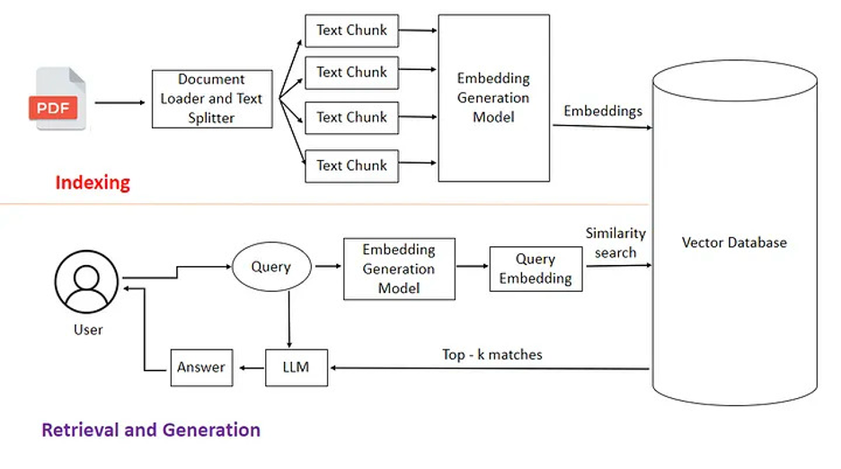
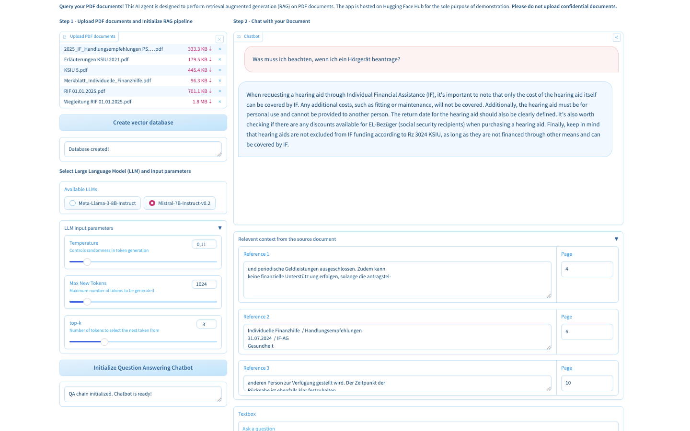
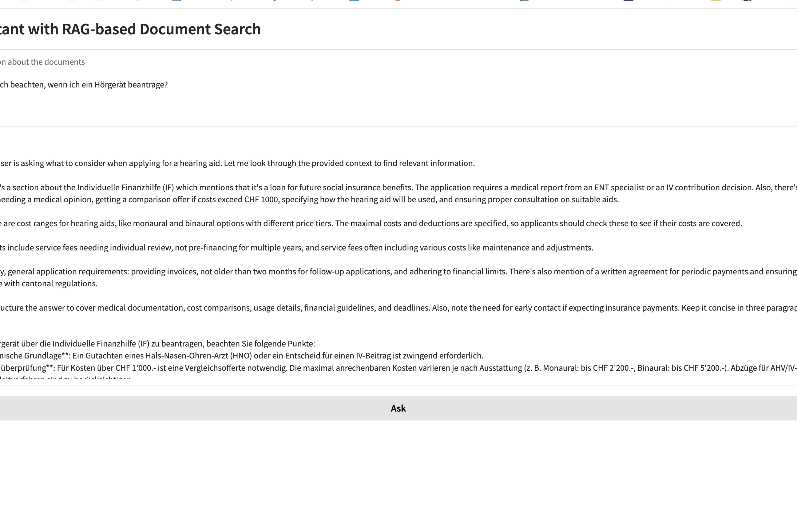
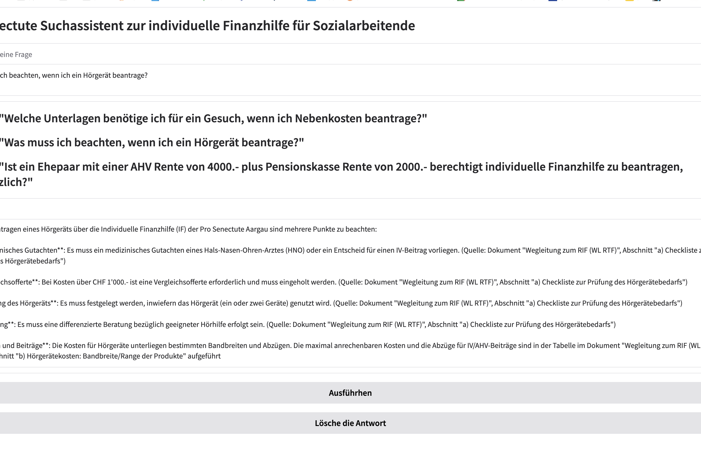

# proSenectute_sw_assistant
AI Assisstant for social worker in Pro Senectute for requirements information on a financial help for clients.

Ausgangslage: Ein Angebot der Pro Senectute ist die Individuelle Finanzhilfe. Diese Unterstützung richtet sich an Personen im AHV-Alter, die sich in einer finanziellen Notlage befinden, und wird von der Pro Senectute im Auftrag des Bundes bereitgestellt. Sie bietet Unterstützung bei dringend notwendigen Ausgaben, welche weder durch private Mittel noch durch die Sozialversicherung gedeckt werden können. Die Anträge für Individuelle Finanzhilfe werden von der Pro Senectute geprüft. Diese Anträge werden nicht nach Lust und Laune bewilligt… hierzu gibt es strenge und komplizierte Reglemente, welche eingehalten werden müssen. Diese Reglemente erschweren die Einarbeitung unserer Sozialarbeitenden. Kontroller kontrolliert die Anträge und lehnt diese ab, falls gemäss Statuten die Hilfe nicht erlaubt wäre.

Zielsetzung: Entwickeln einer KI-Gestützten Suchmaschine für die Reglemente der Individuellen Finanzhilfe, welche genaue und zuverlässige Antworten gibt. Die Suchmaschine soll in der Lage sein, eine Quelle der gegebenen Antworten zu geben (z.B. “Dokument” Abschnitt 1, Ziffer 2). Es soll die Möglichkeit geben, diese Suchmaschine einfach auf andere Reglemente zu erweitern (z.B. Internes Personalreglement).

Problem: Social worker (SW) needs to make sure not to make mistakes, pay too much, make a wrong payment, based on statutes to help the client. If SW would get the right information the decision would be bettet.

Ressourcen:

Die Reglemente der Individuellen Finanzhilfe.
Fallbeispiel für ein IF-Gesuch
Merkblatt Individuelle Finanzhilfe (Link: )
Mateo Soppelsa (anwesend)

Requirements that would help to do it well:

- Examples of questions, queries for the AI assistant on the subject that need to look at.
-

Ideas for a solution:

Using a RAG (retrieval augmented generation) AI assisstant that discects the documents and tries to answer the question based on the instructions given. 
A Webpage Solution for the intranet of the organisation would be most optimal.
It should run on a microsoft server in the the data center. 
 Output would be a text answers, perhaps with links, name of the document, page and or citation of the text section containing the refered information.
 Try to use API for an LLM for RAG that is free/open source.
 
 For presentation show an example, we had a question, what happens do this, RAG model going from one step to another, like a framework, there are different ways, or one or two approach.

Already existing aproaches for RAG PDF Q&A Assitant: https://huggingface.co/spaces/MuntasirHossain/RAG-PDF-Chatbot
We tested it, it gives o.k. answers, but need some improvement on the clear references of the documents. And we need to adapt it to more insight.

State of dev: 6pm friday, we have a gradio app with qwq model that uses rag and one document and gives good answer:

State of dev: 10pm going home: 

To do list:
- (ok) Make gradio app usable from the web for testing purposes, with ngrok done.
- (ok) Make sure that all documents in folder are being loaded and used for processing
- (ok) create a button for clearing the input
- (ok) alles auf Deutsch
- (ok) Instruct RAG to reference to the document, page and text section that it refers to.
- (ok) showing examples for questions
- (ok) create an option to chose between most relevant clues for the question (k=3-5, temp=0.1, different prompt) or most of clues (k=20, temp=0.6, openly formulated propmt) 

- (ok) Define a template for the prompt: like "I am a new SW at Pro Senectute help me answer this question... (Mateo)
- (ok) Test the example questions and save the output (Mateo/Anand)
- (ok) Define a file for prompt_template for development (Dragan)
- (ok) output the used chunks in a file for validation
- (ok) make a presentation of our challenge (Mateo)
- make a version running on a linux server
- (ok) test bigger models 100B+ for inference (with larger GPUs)
- analyze caseexamples for usable questions to ask
- (ok) log every session in a log_file

nice to have:
- create a feature to be able to save the queries/prompts for further use
- create a feature to load additional documents beside the available ones
- link all the related documents that were used for asissting
- create a docker enviroment for the roll out
- create a login feature for SW based on their AD credentials
- extend the feature of giving feedback for the output with thumbs up or down and collect the it in log and make a simple frequency statistics on the feedback

Open questions:
- Hardware, Software, Solition requirements?
Social Worker has a MS windows 11 OS without GPU to run a LLM solutution on premise.
A browser solution would be bettet.

- What should be the input in the AI assistant?
SW should make a question and use the data.

- SW who is he, new worker or experienced worker, decide on the. Focus on new worker and their needs, more generic questions not on experienced with very speciall questions.

Es sind ziemlich ähnliche Fragen, welche :

1. Was muss ich beachten, wenn ich ein Hörgerät beantrage?
Es muss einfach zweckmässig sein, im Verhältis kosten, man mus subsidirität beachten, ahv, man muss akblären of kranken kasse zahl, man braucht offerte, man muss service vertrag. 
Quelle, in der Wegleitung RIF Anhang H, und in den Handlungsempfehlungen PS CH udn PS AG pdf, Seite 6 Hörgeräte erwähnt.  

2. Welche Unterlagen benötige ich für ein Gesuch, wenn ich Nebenkosten beantrage?
Antwort: " Für ein Gesuch zur Beantragung von Nebenkosten im Rahmen der Individuellen Finanzhilfe bei Pro Senectute benötigen Sie folgende Unterlagen:

1. **Verfügung der Ergänzungsleistungen inkl. Berechnungsblatt**: Dieses Dokument zeigt die finanzielle Situation der gesuchstellenden Person und ist ein wesentlicher Bestandteil des Gesuchs.
2. **Weitere Belege über die finanzielle Situation**: Dies können rechtskräftige Steuerveranlagungen, Bankbelege oder andere Dokumente sein, die die finanziellen Verhältnisse belegen.
3. **Belege der beantragten Kosten**: Dies können Rechnungen, Kostenvoranschläge oder andere Dokumente sein, die die Nebenkosten belegen.

Quellenangabe: Pro Senectute Schweiz, Individuelle Finanzhilfe beantragen – Vorgehen und benötigte Unterlagen, Abschnitt "Gesuche werden grundsätzlich im Rahmen einer Sozialberatung bei Pro Senectute gestellt", Seite 2."

3. Ist ein Ehepaar mit einer AHV Rent 4000 plis PK Rente 2000.- berechtigt IFH zu beantragen, grundsätzlich?
4. Ein Klient hat eine Rechnung von 3000.- für Nebenkosten Wohnnebenkosten, diese Rechnung wurde vor 6 Monaten bezahlt, kann ich diese Gelder über IF beantragen?
5. Schreibe mir ein Gesuch, für eine Brille, das Gesuch beinhaltet, Ausgangslage, Ziel, Subsidiarität, Partizipation?

Es wurde schon versucht mit ChatGPT zu testen, es gab keine Logik für die Antworten, die Antworten ware nicht konzise. 

